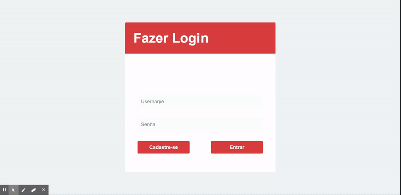

<h1>Store Control</h1>



  


Store control é um serviço web simples de cadastro de produto e cadastro de usuários que possam acessar o sistema, feito utilizando a framework de Python Django, para o back-end e front-end, utilizando o sistema de templates que a ferramenta oferece.

## Como instalar
Para instalar o projeto, você irá precisar ter o Python 3, Virtualenv e pip instalados para baixar as dependências. Clone os arquivos do projeto e execute os comandos abaixo.

---

### Instalação
Dentro da pasta `store-control-templates`

#### Windows
```bash
pip install -r requirements.txt
Scripts/activate
cd .\storecontrolapp\
python manage.py runserver
```

#### Linux
```bash
$ pip install -r requirements.txt
$ /bin/activate
$ cd .\storecontrolapp\
$ python manage.py runserver
```

Quando terminar, basta acessar a url indicada no terminal.

---
###### Developed by [Gean Lucas](https://www.linkedin.com/in/geanlucaas/) :rocket:.